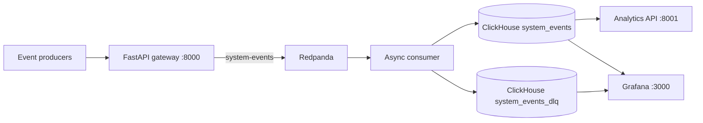

# StreamPulse

Distributed real-time log and event analytics using Redpanda, ClickHouse, FastAPI, and Grafana.

## Architecture



The gateway validates HTTP payloads before publishing. Records injected directly into Kafka are parsed and schema-checked by the consumer; malformed records are written to the DLQ without stopping the consumer.

## Start The Stack

Prerequisites: Docker Desktop with Compose and Python 3.11+ for local load tests.

```powershell
docker compose up -d --build
docker compose ps
```

Services:

- Gateway: `http://localhost:8000/docs`
- Analytics API: `http://localhost:8001/docs`
- Grafana: `http://localhost:3000` (admin/admin for local development)
- ClickHouse HTTP: `http://localhost:8123`

The local example ClickHouse credentials are `default/admin`. Change the password in `docker-compose.yml` and `services/grafana/provisioning/datasources/clickhouse.yml` before using this outside a local environment.

## Send An Event

The gateway route is `POST /api/v1/events`.

```powershell
$body = '{"service_name":"checkout-service","event_type":"payment_processed","environment":["production"],"payload":"{\"order_id\":99482}","latency_ms":120}'
Invoke-RestMethod -Uri "http://localhost:8000/api/v1/events" -Method Post -ContentType "application/json" -Body $body
```

The response should contain `"status": "queued"`. `environment` must be an array. HTTP schema failures return `422` and do not enter Kafka.

## Load Test

The configurable HTTP benchmark defaults to 10,000 requests and concurrency 50. For a sustained run:

```powershell
$env:TOTAL_REQUESTS = '50000'
$env:CONCURRENCY = '200'
& ".\.venv\Scripts\python.exe" ".\load_tests\load_generator2.py"
```

Verified benchmark on 2026-09-10:

- 50,000 requests at concurrency 200
- 50,000 accepted with HTTP 202
- 446.58 seconds elapsed
- 111.96 requests/sec
- Consumer micro-batches were typically about 100 events per flush
- No insert or DLQ errors observed during the run

## DLQ Test

Gateway schema violations are rejected at the HTTP boundary. To test the consumer DLQ path, inject invalid records directly into Redpanda:

```powershell
@('{bad-json'; '{"service_name":"dlq-test","event_type":"invalid_environment","environment":"production","payload":"bad schema","latency_ms":1}') | docker exec -i stream-pulse-redpanda rpk topic produce system-events --format '%v\n'
```

The consumer logs `Routed 2 invalid records to DLQ`, and the records are stored in `default.system_events_dlq`.

## Grafana Dashboard

The provisioned `StreamPulse Real-Time Analytics Engine` dashboard includes:

- Total events
- Average latency
- P99 latency
- Events processed over time
- Dead-letter event count
- DLQ rate as a percentage of total events
- Average latency over time

Refresh the dashboard after a load test and select a time range that includes the test, such as **Last 15 minutes**.

## Useful Checks

```powershell
docker exec stream-pulse-clickhouse wget -qO- --user=default --password=admin "http://127.0.0.1:8123/?query=SELECT%20count()%20FROM%20default.system_events"
docker exec stream-pulse-clickhouse wget -qO- --user=default --password=admin "http://127.0.0.1:8123/?query=SELECT%20count()%20FROM%20default.system_events_dlq"
docker compose logs --tail 100 consumer
pytest -q
```
